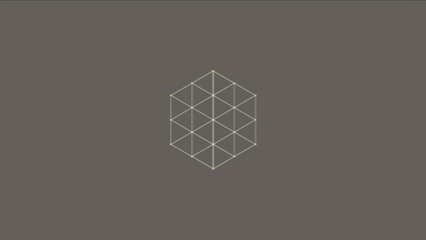

# SIMPLIFIED OSKAR-STALBERG
## Overview
This project implements a simplified procedural terrain-grid generation approach inspired by the geometric techniques used by Oskar Stålberg, with the goal of producing a naturally structured, hexagon-based grid that can later be deformed into terrain.

The system is designed for Unity using C#.

The generation process starts from a single equilateral triangle and progressively builds concentric rings of triangles. These triangles are then converted into a set of faces, subdivided and quadified to produce a dense interior grid. Finally, a relaxation step distributes the interior vertices while preserving the outer hexagonal boundary.

The intended final topology resembles a large hexagon filled with interconnected quads, providing a suitable foundation for procedural terrain generation.

## Environment
- Engine: Unity

- Language: C#

## Disadvantages
Less complex patterns than the original algorithm.

## Basic Geometry

The system already contains two classes:

### Triangle

A triangle stores three points:
```
Vector2 a
Vector2 b
Vector2 c
```

### Face

A face stores four points:

```
Vector2 a
Vector2 b
Vector2 c
Vector2 d
```

These classes are intentionally simple and primarily represent the connectivity of the generated geometry.

All triangles and faces use the same winding order (clockwise), so that meshes built from the grid have consistent normals.


## Explanation

### Step 1: Initial Generation of Triangles

We first create the initial "ring" of triangles. We begin by creating two points: `(0, 0)` and `(0, unit)`. `unit` is customizable and determines the size of the overall grid.

We then calculate a third point so that the three points form an equilateral triangle. The third point `c` is found by rotating the `a-b` direction by 60° and keeping the length `unit`. The rotation is always `-60°` (to the right of `a-b`) for this ring. The triangle will have:

```csharp
a = (0, 0)
b = (0, unit)
c = calculated point
```

This triangle is stored in:

```csharp
triangles[ring][0]
```

with `ring = 0` initially.

For each following triangle, we repeat the process by considering the `a-c` edge of the previous triangle as the initial edge of the new triangle (`a = previous.a`, `b = previous.c`). We repeat this process five more times until the ring is closed, forming the first hexagon.

For the second ring, we use the `b` and `c` points of each triangle in the first ring as the `a` and `b` points of the corresponding triangle in the second ring:

```csharp
triangles[1][0].a = triangles[0][0].b;
triangles[1][0].b = triangles[0][0].c;
```

The third point of the second ring is calculated by rotating the `a-b` direction by `+60°` (to the left of `a-b`). Rotating to the right would place it back in the first ring.

The third ring is generated using the same rule for `a` and `b`, using the second ring as its reference, but the third point is rotated by `-60°` again (to the right of `a-b`).

Finally, the fourth ring is used to close off a second hexagon. For example, to calculate `triangles[3][0]`:

```csharp
triangles[3][0].a = triangles[2][0].a;
triangles[3][0].b = triangles[2][0].c;
triangles[3][0].c = triangles[1][1].c;
```

In general, `triangles[3][i].c = triangles[1][(i + 1) % 6].c`, so the last triangle uses `triangles[1][0].c`.

---


### Step 2: Turning the Triangles into Quads

After the triangle generation phase is complete, we fill a new vector called `faces`.

The first ring of triangles is used to create three faces:

```text
triangles[0] + triangles[1]
triangles[2] + triangles[3]
triangles[4] + triangles[5]
```

The second ring works together with the third ring to create additional faces. For example, triangle `0` from the second ring is combined with triangle `0` from the third ring to create a face.

As a result, the triangles from the fourth ring are left untouched.

The vertices of each face are ordered clockwise:

```csharp
// first ring, pair (i, i + 1)
face = (triangles[0][i].b, triangles[0][i].c, triangles[0][i + 1].c, triangles[0][i].a)

// second + third ring
face = (triangles[1][i].a, triangles[1][i].c, triangles[2][i].c, triangles[1][i].b)
```

---

### Step 3: Subdividing Faces and Quadifying the Remaining Triangles

We then use two auxiliary methods: `Quadification` and `Subdivision`.

```csharp
public Face[] Quadification(Triangle triangle)
{
    // Returns 3 faces
}
```

`Quadification` takes a triangle and returns three faces by dividing each edge of the triangle and connecting the resulting points to the center of the triangle.

```csharp
public Face[] Subdivision(Face face)
{
    // Returns 4 faces
}
```

`Subdivision` takes a face and subdivides it into four smaller faces.

Both methods keep the winding order of their input.

Finally, we fill the last vector, `facesFinal`. This vector contains all the faces resulting from the subdivision of every face in the initial `faces` vector, as well as the faces resulting from the quadification of every fourth-ring triangle.

---

### Step 4: Final Step — Relaxation Algorithm

The final step is to apply a relaxation algorithm to the generated faces.

The relaxation should only affect the interior points of the grid and must not move the outermost points of the hexagon. At this stage, the grid will look like a large hexagon containing many quads.

The goal is to relax the interior vertices while keeping the outer hexagonal boundary fixed, so that the overall hexagonal shape is preserved.



## End

In the end, we achieved our goal: we created a somewhat interesting and naturally shaped grid.

There are several directions this system could be taken further. One possibility would be to create a method for generating neighboring grids and connecting their shared vertices. This would allow multiple hexagonal grids to be seamlessly connected into a larger map.
Another possibility would be to store each face in a graph, keeping track of which faces are adjacent to one another. This would open the door to many more interesting developments, such as:


* **WFC (Wave Function Collapse)** to generate more natural tilemaps.
* **Tile-based movement**, allowing entities to move from one face to an adjacent face.
* **Biome generation**, where different regions of the graph can be assigned different biome types.
* **Pathfinding**, using the face adjacency graph as the basis for navigation.
* **Procedural map generation**, using the relationships between neighboring faces to create larger and more complex worlds.


## Example

For this example, I'm using some scripts from an older project. However, they were originally designed for a different context, so they don't perfectly match the scripts used in this project, which was designed with a 2D grid in mind.

### 1. Create the Grid Generator

In an empty Unity scene, create an empty GameObject.

Rotate it **90° around the X axis** and attach:

```text
HexGridGenerator.cs
```

This object will be responsible for generating the grid.

### 2. Create the Tile Collider

Create another empty GameObject and rotate it **90° around the X axis**.

Attach:

```text
TileColliderGenerator.cs
```

This script creates a single mesh collider containing multiple faces based on the generated grid. It allows us to determine which tile was hit when performing a raycast against the grid.

### 3. Create the Manual Grid Builder

Create another empty GameObject and attach:

```text
ManualGridBuilding.cs
```

In the Inspector, add **3 materials** to its `Materials` list.

### 4. Connect the Components

At this point, make sure the scene contains only the objects required for the example:

* The **Grid Generator**
* The **Manual Grid Building** object
* The **Tile Collider Generator**

Select the `ManualGridBuilding` object and, in the Inspector, assign the `TileColliderGenerator` object to the field named:

```text
Tile Collider Generator
```

### 5. Position the Camera

Finally, position the camera above the grid:

```text
Position:
X = 0
Y = 10
Z = 0
```

Set the camera's X rotation to:

```text
X = 90°
```

The camera should now be looking directly down at the generated grid.

### Result


This grid works better for 2D applications. For 3D, you can create a **dual grid**, where the second grid is made up of points located at the center of every face of the Stålberg grid.

In this setup, objects or tiles are placed on the **vertices of the Stålberg grid**, while the terrain is deformed based on the secondary grid. This allows the face-centered grid to control the deformation while keeping the original grid as the basis for object and tile placement.

You can achieve an even more stylized look by reducing the `unit` value. This creates a denser grid, which is useful when you want smoother terrain deformation and don't need to treat each individual tile as a distinct element.

